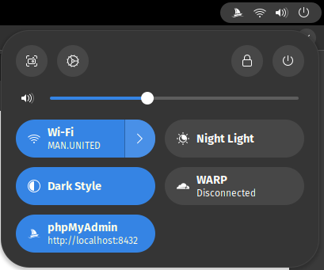
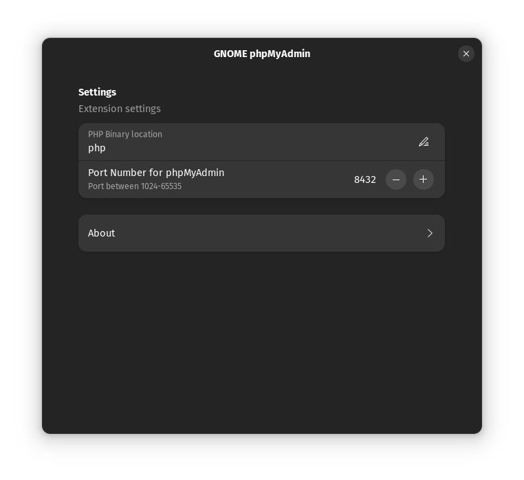

# GNOME phpMyAdmin

GNOME extension to run phpMyAdmin using php built in server.



## Reason Behind This Extension

In the past we use Apache or NGINX to serve phpMyAdmin using php. Currently, we can use php built in server to running phpMyAdmin. Just running `php -S localhost:8080` in phpmyadmin folder, it will serve the application.

But, this extension make your life easier. Just toggle from Quick Settings. No need to run terminal to start and stop php server.

This extension will download phpMyAdmin, add it to Quick Settings of GNOME Shell, If you toggle enable this item, it will start php built in server and also open phpMyAdmin in your default browser.

## Manual Installation

1. Clone Repository:

```bash
git clone https://github.com/hsnfirdaus/gnome-phpmyadmin.git
cd gnome-phpmyadmin
```

2. Install PHP (Required).  
   You can install PHP from your distribution repository. For example Arch:

```bash
sudo pacman -Syu php
```

3. Download phpMyAdmin zip and extract to `src/phpmyadmin` folder (Need to install `curl`):

```bash
./download.sh
```

You can also change config.inc.php in `src/phpmyadmin` folder after running that command.

4. Install extension to user extension directory:

```bash
./install.sh
```

## Configuration



You can configure port and php binary that will be used in extension settings.
